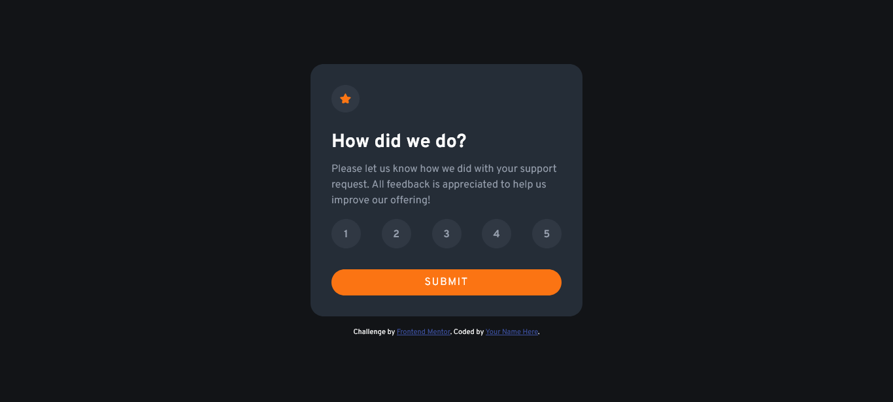
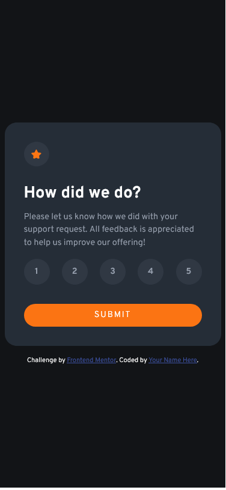
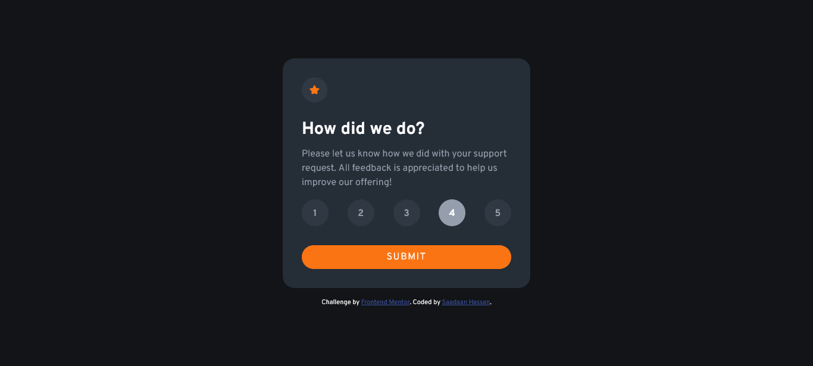

# Frontend Mentor - Interactive rating component solution

This is a solution to the [Interactive rating component challenge on Frontend Mentor](https://www.frontendmentor.io/challenges/interactive-rating-component-koxpeBUmI). Frontend Mentor challenges help you improve your coding skills by building realistic projects.

## Table of contents

- [Overview](#overview)
  - [The challenge](#the-challenge)
  - [Screenshot](#screenshot)
  - [Links](#links)
- [My process](#my-process)
  - [Built with](#built-with)
  - [Useful resources](#useful-resources)
- [Author](#author)

## Overview

### The challenge

Users should be able to:

- View the optimal layout for the app depending on their device's screen size
- See hover states for all interactive elements on the page
- Select and submit a number rating
- See the "Thank you" card state after submitting a rating

### Screenshot

- Desktop Rating Card Preview

  

- Desktop Thank You Card Preview

  

- Mobile Rating Card Preview

  

- Mobile Thank You Card Preview

  

### Links

- Solution URL: [Front-End Mentor](https://www.frontendmentor.io/solutions/interactive-rating-card-using-flexbox-wQFS00uRSS)
- Live Site URL: [Interactive Rating Card](https://saadaan-hassan.github.io/Interactive-Rating-Card/)

## My process

### Built with

- Semantic HTML5 markup
- CSS custom properties
- Flexbox
- Mobile-first workflow

Overall the project was interesting. I enjoyed making this project. The major part of the project was using the *rating* option selected in the **Rating Card** and using its value in the **Thank You Card**. As it is a Rating Card, so the user must select one and only one option out of 5. At first, when I saw the project, two approaches came to my mind.

1. First I can display rating options as simple buttons in an HTML file.
2. Second I can display them as radio buttons.

I went with the second approach, as it was simple compared to the first approach. If I had gone with the first approach then in javascript I would have had to write extra code for buttons. The purpose of this code would be the same as radio buttons. This means that the user must select only one of the given rating options.

Going with the second approach made my JS code much shorter and easy. So in my opinion the second approach was the best one.

Here is how I made my "rating options" into radio buttons.

**HTML Code**

```html
<div class="options-container flex">
  <input type="radio" id="option-1" name="select" value="1" /><label
    for="option-1"
    class="options"
    >1</label
  >

  <input type="radio" id="option-2" name="select" value="2" /><label
    for="option-2"
    class="options"
    >2</label
  >

  <input id="option-3" type="radio" name="select" value="3" /><label
    for="option-3"
    class="options"
    >3</label
  >

  <input id="option-4" type="radio" name="select" value="4" /><label
    for="option-4"
    class="options"
    >4</label
  >

  <input id="option-5" type="radio" name="select" value="5" /><label
    for="option-5"
    class="options"
    >5</label
  >
</div>
```

**CSS Code**

```css
.options-container {
  justify-content: space-between;
}

input[type="radio"] {
  display: none;
}

.options {
  --size: 2.8125rem;

  font-size: var(--fs-medium);
  background-color: var(--color-neutral-300);
  color: var(--color-neutral-200);
  font-weight: var(--fw-bold);
  width: var(--size);
  height: var(--size);
  text-align: center;
  line-height: 3;
  margin-block: 1rem;
  border-radius: 100%;
  cursor: pointer;
}

.options:hover {
  background-color: var(--color-primary);
  color: var(--color-neutral-100);
}

input[type="radio"]:checked + .options {
  background-color: var(--color-neutral-200);
  color: var(--color-neutral-100);
}
```
**Preview:**



<br>As one of my issues (making the user select only one option) was resolved, the only issue remaining was using the rating value in the **Thank You Card**. Because of using radio buttons, this issue was also resolved quickly. All I had to do was take the value of the **checked radio button** and show it as the selected rating in the **Thank You Card**.
Here is how I had done it.

Here how I had done it.

**Javascript Code**

```js
const input = document.getElementsByTagName("input");
const rating = document.getElementById("rating");

let value = 0;

for (let i = 0; i < input.length; i++) {
  if (input[i].checked) {
    value = parseInt(input[i].value);
  }
}

rating.innerHTML = value;
```

**Preview:**


### Useful resources

- [Stack Overflow](https://stackoverflow.com/questions/45259139/how-to-put-text-inside-radio-button) 

## Author

- Frontend Mentor - [@Saadaan-Hassan](https://www.frontendmentor.io/profile/Saadaan-Hassan)
